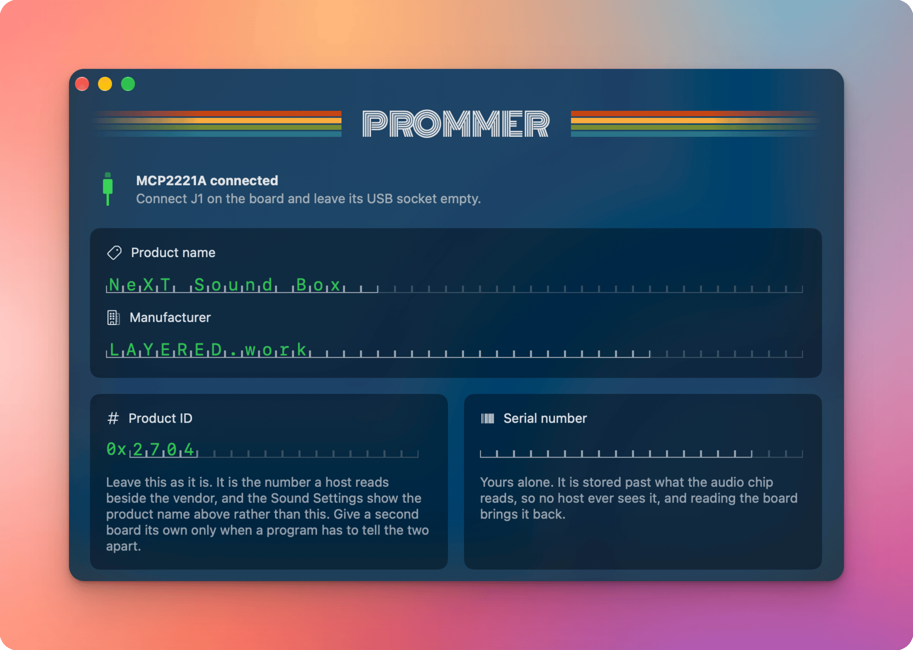

<div align="center">

[](https://layered.mit-license.org)
[](https://github.com/phranck/prommer/commits/develop)
[](https://github.com/phranck/prommer)
[](https://github.com/phranck/prommer)
[](https://github.com/phranck/prommer)



</div>

# Prommer

Prommer writes the USB identity of a NeXT Sound Box mini into the EEPROM on its board. It is a macOS app, built with SwiftUI, for macOS 15 and later.

A PCM2704C has no identity of its own. After every power-on reset it reads seven descriptor fields out of an external EEPROM and uses them to override its built-in USB descriptors, which is what decides the name a host shows, who the host thinks built it, and how much current it is allowed to draw. Prommer builds those 57 bytes, writes them over an [Adafruit MCP2221A breakout](https://www.adafruit.com/product/4471) on the board's programming header, reads them back and compares.

Behind the descriptor it stores a serial number that the audio chip never reads and no host ever sees. Reading a board brings everything back into the window, so a board can be read, adjusted and written again without retyping anything.

It also identifies the chip on the bus without writing to it. Scanning the eight addresses a 24-series part can take gives the size, and reading past the 256-byte mark shows whether the address counter wraps there. That separates a part the audio chip can read from one it cannot, which otherwise shows up only as a board that never enumerates.

## Building

```bash
xcodebuild -project Prommer.xcodeproj -scheme Prommer test
```

The Xcode project is the single source of truth and is not generated. `Sources` and `Tests` hang in it as synchronized folders, so a new file is picked up without editing the project.

## License

This repository has been published under the [MIT](https://layered.mit-license.org) license. The bundled typeface carries its own, which [THIRD-PARTY-NOTICES.md](THIRD-PARTY-NOTICES.md) names.
